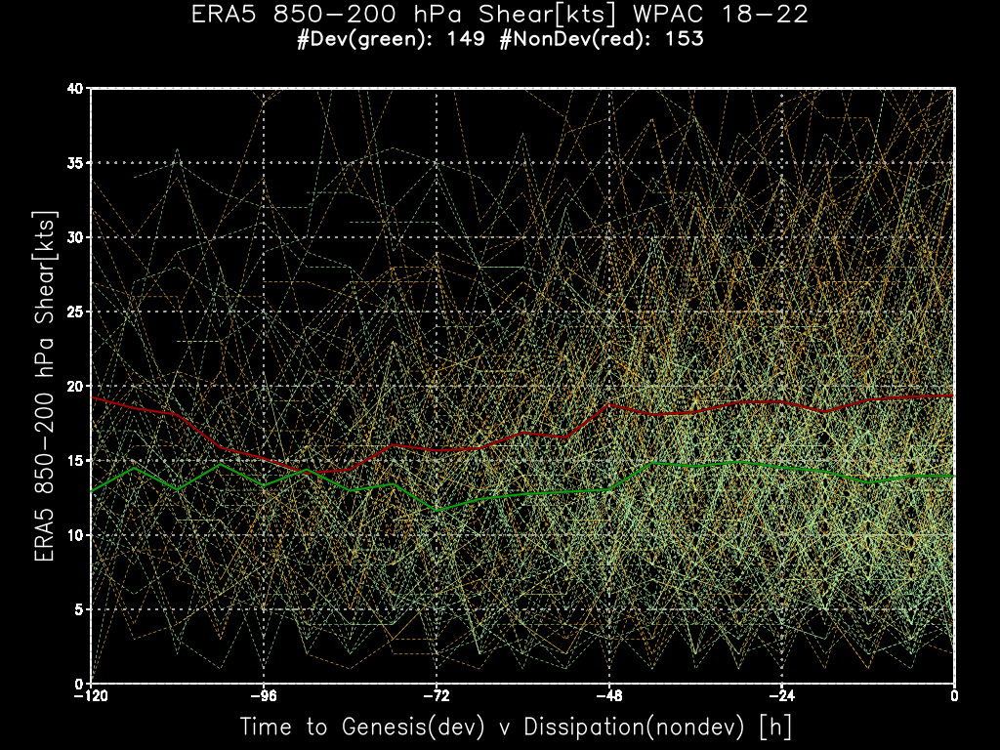

superBT-V04
============================

Welcome to the first release of the super Tropical Cyclone (TC) Best Track (BT). 

This is version V04 ... the initial beta release 

https://tenkiman.github.io/superBT-V04

for an introduction and description of the .csv files that are the superBT.

V10 will go back to 2006 and include 2023 for a 17-y record. Additional data on the R34 
(Radius of 34 kt winds or Gale Force winds) from CIRA and ERA5 will give a more complete set 
of structure information than in the best tracks.
