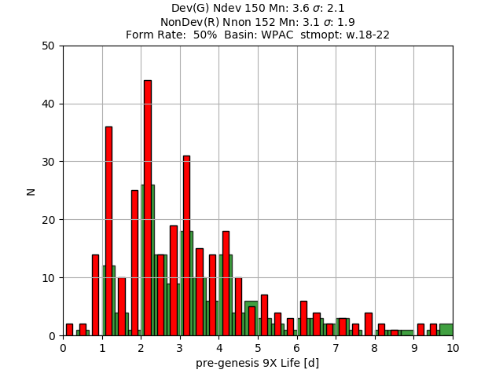
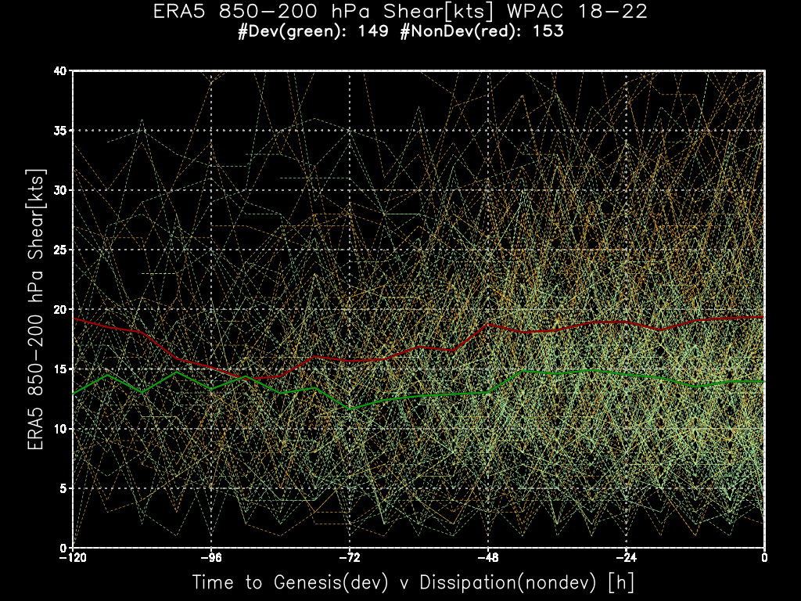

<div align="center">

<h1>superBT-V04 - The Details</h1>
<h3>a "super" Best Track (BT) for Tropical Cyclone (TC) Forecasting and Research</h3>

Mike Fiorino (mfiorino@gmu.edu)</br>
<b> 30 January 2024 </b></br>
<b>  8 May 2024 </b>
</div>

Welcome to the 1st beta release (V04) of Mike Fiorino's <ins><b>superBT</ins></b> -- a <ins><b>super</b></ins>position of **TC-centric** *dynamical*
(ERA5 10-d forecasts) and *thermodynamical* (satellite precipitation analyses)
 data onto the operational TC position/structure <ins><b>BT</ins></b> of
 [JTWC](https://www.metoc.navy.mil/jtwc/jtwc.html "JTWC home page: https://www.metoc.navy.mil/jtwc/jtwc.html")
and [NHC](https://www.nhc.noaa.gov/ "NHC home page: https://www.nhc.noaa.gov/").

The <ins><b>superBT</ins></b> can also be considered as
'[IBTRaCS](https://www.ncei.noaa.gov/products/international-best-track-archive
"IBTRaCS: https://www.ncei.noaa.gov/products/international-best-track-archive" ) ++', i.e., a TC position/structure data set with additional
variables (e.g., vertical wind shear) known to be important in TC intensity/structure
change.

### Table of Contents

- [Key properties of the data set:](#key-properties-of-the-data-set)
- [Unique Properties:](#unique-properties)
- [Two Demos of unique superBT TC analyses](#two-demos-of-unique-superbt-tc-analyses)
  * [***TC formation rate*** or the % of all pTCs --> TCs](#tc-formation-rate-or-the-%25-of-all-ptcs----tcs)
  * [***vertical wind shear between 9Xdev and 9Xnon***](#vertical-wind-shear-between-9xdev-and-9xnon)
- [Data files](#data-files)
- [Documentation](#documentation)
  * [superBT blog with intro:](#superbt-blog-with-intro)
  * [presentations](#presentations)
  * [docs/ directory](#docs-directory)
- [How to access/install:](#how-to-accessinstall)

### TC label/numbering and Date-Time conventions

<!--
mouse over  lists...
-->

[TCs]: ## "
TD  - Tropical Depression : Vmax < 35 kts
TS  - Tropical Storm      : Vmax >=35 & Vmax < 64 kts
HU  - Hurricane           : Vmax >=65kts
STY - Super Typhoon       : Vmax >= 130 kts
SD  - Subtropical Depression : Vmax < 35 kts
SS  - Subtropical Storm      : Vmax >=35 & Vmax < 64 kts
"

[NHEMcodes]: ## "
B - Bay of Bengal
A - Arabian Sea
I - North Indian Ocean (NIO) both B & A
W - Western north PACific (WPAC)
C - Central north PACific (CPAC)
E - Eastern north PACific (EPAC)
L - north atLANTic (LANT)
"

[SHEMcodes]: ## "
S - South Indian Ocean (SIO)
P - southwest Pacific ocean
H - SHEM S & P 
"

#### date-time format

The standard NWP and US Navy 'date-time-group' format is used throughout the docs and data:

**`YYYYMMDDHH`**

12 UTC 1 July 2022 would be coded as `2022070112` NB: sometimes the HH will be dropped to indicate the date only


### Key properties of the data set:


- 2007-2022 - 16-y data set

- Final (latest/greatest) BT:
  - JTWC 2007-2021
  - NHC 2007-2022

- Global - NHEM (A,B,I,W,C,E,L) & SHEM basins (S,P,H)
  - [NHEM Subbasin 1-char codes][NHEMcodes] (mouse over)
  - [SHEM Subbasin 1-char codes][SHEMcodes] (mouse over)

- JTWC/NHC [ATCF](https://www.nrlmry.navy.mil/atcf_web/index1.html
"https://www.nrlmry.navy.mil/atcf_web/index1.html" ) data files
  - "bdeck" -- best track operational (working) or 'final' (post-season) positions/structure
  - "adeck" -- "aid" forecasts (e.g., GFS model forecast track) and real-time operational positions/structure

- three TC types **NN** ; **9Xdev** ; **9Xnon**
  - **NN** - [a numbered/named (01-50) TC in the JTWC/NHC BT files][TCs] (mouse over)
    - not necessarily Tropical Storms (**TS** with winds >= 35 kts) 
  - **9Xdev** - the pre/potential TC (pTC or 9X) disturbance that developed into an **NN** TC
  - **9Xnon** - pTC that did ***not develop*** into an **NN** TC

- ***dynamical*** variables (e.g., vertical wind shear) from [ECMWF ERA5 reanalysis](https://www.ecmwf.int/en/forecasts/dataset/ecmwf-reanalysis-v5
"ERA5: https://www.ecmwf.int/en/forecasts/dataset/ecmwf-reanalysis-v5") 10-d NWP global forecasts for:
  - storm and large-scale *environment* diagnostics - the *diagnostic file* - input to e statistical-dynamical TC intensity prediction models 
  - model track/structure forecasts

- ***thermo*** variables (rain) from  three global, high-resolution precipitation analyses:
  - [CMORPH - USA - NCEP/CPC V1.0](https://www.cpc.ncep.noaa.gov/products/janowiak/cmorph.shtml
"CPC V1.0 : https://www.cpc.ncep.noaa.gov/products/janowiak/cmorph.shtml")
  - [GsMAP - Japan - JAXA V6](https://sharaku.eorc.jaxa.jp/GSMaP/index.htm
"JAXA GsMAP V6.0: https://sharaku.eorc.jaxa.jp/GSMaP/index.htm ")
  - [IMERG - USA - NASA V06D](https://gpm.nasa.gov/data/imerg "NASA IMERG: https://gpm.nasa.gov/data/imerg" )

- superBT-V04 consists of:
  - 3 `.csv` data files
  - 3 corresponding `.csv` metadata files describing the variables.
  - `py2` directory with a python2 interface for analysis and display

### Unique Properties:

- curated pTC or TC 'seeds' data set based on a zip archive of all ATCF
  adeck/bdeck (pTCs or '9X' or 'INVESTS') from JTWC/NHC operations.  All TCs
  start as pTCs and by having data on both pTCs that *developed* into **NN** TCs
  (**9Xdev**) and did ***not*** develop (**9Xnon**) we can determine the
  ***formation rate*** and the ***dynamical/thermodynamical difference*** between developers and non-developers

- the ***highest quality global NWP analyses*** to date based on the
  high-quality of the daily 00/12 UTC 10-d ERA5 TC forecasts.  The quality of
  the reanalysis does vary with changes in the observing system, but with ERA5
  the TC track forecasts are consistently better than ECMWF operations and
  nearly as good in the 1980s as the 2000s.

- a python2 interface is provided for simple access/slicing and analysis


### Two Demos of unique superBT TC analyses

#### ***TC formation rate*** or the % of all pTCs --> TCs

below is the percentage of both 9Xdev + 9Xnon that became TCs in the Western north PACific (WPAC) in the 5-y period 2018-2022.

From the plot we see:

150 9Xdev average time to ***develop*** is ***3.6 d***</br>
152 9Xnon average time to ***dissipation*** is ***3.1 d***</br>
50% become NN or the ***formation rate*** is 50%</br>

<!--

-->


The plot was made by running this python2 application in the `py2` directory:


```sh
py2/p-md3-stm-anl.py -S w.18-22 -f all.9xlife.0
# output from command (py2) MIKE5-wxmap2 19:24 fiorino@tenkiS /data/w22/superBT/V04/py2 1013 > p-md3-stm-anl.py -S w.18-22 -f all.9xlife.0
TTTTTTTTTTTTTTTTTTTTTTT-------------------timer: md3-load-doSumOnly                                                      :  0.135      at: 2024012018 01:24:20
PPP(pngpath):  /data/w22/superBT/V04/plts/9X2NNformation/all.9xlife.0.w.18-22.png
```
[screen shot of output from running `py2/p-md3-stm-anl.py -S w.18-22 -f all.9xlife.0`](../docs/plt/screen-shot-20240120-19-27.png "click for a screen shot")

#### ***vertical wind shear between 9Xdev and 9Xnon***

The plot below shows the difference in shear between 9Xdev (heavy green
line is the mean) and 9Xnon (heavy red line) for the same basin/years - WPAC 2018-2022



Note how the shear is about 15 kts around 84 h before formation/dissipation for both 9Xdev and 9Xnon.

The 9Xdev developers shear stays <= 15 kts, but for the 9Xnon non-developers
the shear increases > 15 kts reaching 20 kts at dissipation.  This difference
is consistent with JTWC forecaster experience that shear < 15 kts is favorable
for development.

This plot was made by running this application:

```sh
p-sbt-v04-anl-ts.py -S w.18-22 -P shrspd -X
# output:
```
```
(py2) MIKE5-wxmap2 20:06 fiorino@tenkiS /data/w22/superBT/V04/py2 1029 > p-sbt-v04-anl-ts.py -S w.18-22 -P shrspd -X

TTTTTTTTTTTTTTTTTTTTTTT-------------------timer: sbt-init     :  0.763      at: 2024012018 02:06:49
TTTTTTTTTTTTTTTTTTTTTTT-------------------timer: sbt          :  0.874      at: 2024012018 02:06:49
NNN for stmopt:  w.18-22 nNN:  150 nDev 149 nNon 153
DDD rFormDev:  49%  NNM rFormN:  50%   0.2%
CCC: grads -lbc "g-sbt-dev-non.gs w 18-22 shrspd ../gadat ../plts/dev-non"   ---> CurDT: 20240120 20:06:49 <--- 

Grid Analysis and Display System (GrADS) Version 2.2.1.oga.1
Copyright (C) 1988-2018 by George Mason University
GrADS comes with ABSOLUTELY NO WARRANTY
See file COPYRIGHT for more information

ppp ../plts/dev-non/shrspd*w-18-22*png
CCC: xv ../plts/dev-non/shrspd-w-18-22.png   ---> CurDT: 20240120 20:06:51 <--- 
TTTTTTTTTTTTTTTTTTTTTTT-------------------timer: ALL         : 13.571      at: 2024012018 02:07:02
```

[screen shot of output from running `py2/p-sbt-v04-anl-ts.py -S w.18-22 -P shrspd -X`](../docs/plt/Screenshot-2024-01-20-19-52.png "click for a screen shot")


### Data files

The superBT consists of three `.csv` data files and three `.csv` metadata files describing the variables in data files.

| data file | description | # of lines/points
| -:      | :-:   | :-	  
| [all-md3-2007-2022-MRG.csv](../dat/all-md3-2007-2022-MRG.csv) | positions for NN/9Xdev/9Xnondev   | 107050 positions
| [sum-md3-2007-2022-MRG.csv](../dat/sum-md3-2007-2022-MRG.csv)  | summary of each storm  | 5233 storms
| [sbt-v04-2007-2022-MRG.csv](../dat/sbt-v04-2007-2022-MRG.csv)  | superBT     | 86595 positions
| [h-meta-md3-vars.csv](../dat/h-meta-md3-vars.csv) | metadata for all-md3-*.csv | 32 variables
| [h-meta-md3-sum-vars.csv](../dat/h-meta-md3-sum-vars.csv) | metadata for sum-md3-*.csv | 25 variables
| [h-meta-sbt-v04-vars.csv](../dat/h-meta-sbt-v04-vars.csv) | metadata for sbt-v04*.csv | 66 variables

### Documentation

There are two sources for documentation on science applications.  The blog and
talks given while I was in Japan and for a US-UK project.

#### superBT blog with intro
     
- the [superBT blog](https://surperbt.blogspot.com/ "https://surperbt.blogspot.com/") has an [introduction](https://surperbt.blogspot.com/2023/12/intro-to-superbt.html "https://surperbt.blogspot.com/2023/12/intro-to-superbt.html") with links and a further analysis of ***formation rate*** in the big basins and the ***dynamical*** (wind shear) and ***thermodynamical*** (precipitation) differences between **9Xdev** and **9Xnon**

#### presentations

- this  [presentation for the HURICAN Project in 202303](https://tenkiman.github.io/superBT-V04/docs/tc-superBT-20230310.pptx
  "https://tenkiman.github.io/superBT-V04/docs/tc-superBT-20230310.pptx") gives:
  - details on the ATCF data files used for the TC positions/structure
  - track forecast skill of the ERA5 forecasts
    - as good or better the ECMWF operational runs
    - consistent skill even in the 1980s v 2000-2022
    - quality of the three precipitation analyses
    
- this [talk at AORI/UofTokyo in 202210](https://tenkiman.github.io/superBT-V04/docs/tc-superBT-climate-studies-20221017.pdf "https://tenkiman.github.io/superBT-V04/docs/tc-superBT-climate-studies-20221017.pdf") shows how a superBT should be useful for TC climate studies.

- this [presentation at the 2024 Annual INDOPACOM Tropical Cyclone Conference on 20240419](https://github.com/tenkiman/superBT-V04/blob/v04/docs/MF-TCC-2024-superBT-202240418-V3.pptx 	"https://github.com/tenkiman/superBT-V04/blob/v04/docs/MF-TCC-2024-superBT-202240418-V3.pptx") shows how the superBT could be used in TC forecast tool development.
											         
#### docs/ directory


- [docs/](https://github.com/tenkiman/superBT-V04/tree/main/docs)
    - [plt/](https://github.com/tenkiman/superBT-V04/tree/v04/docs/plt) :: plots used in this doc and other docs 
    - [NB/](https://github.com/tenkiman/superBT-V04/tree/main/docs/NB) ::  **N**ota **B**ene directory with issues/problems
        - [20231212](https://github.com/tenkiman/superBT-V04/tree/main/docs/NB/20231212) :: Why number of 9Xdev in mdeck3 is not the same is in the superBT
    - [README-sbt-v04-py2.md](https://tenkiman.github.io/superBT-V04/docs/README-sbt-v04-py2.md)
    - [README-sbt-mike5.md](https://tenkiman.github.io/superBT-V04/docs/README-sbt-mike5.md)
    - [README-sbt-v04.md](https://tenkiman.github.io/superBT-V04/docs/README-sbt-v04.md)
    - [README-sbt-v04-vars.md](https://tenkiman.github.io/superBT-V04/docs/README-sbt-v04-vars.md)
    - **[superBT-V04.tgz](https://tenkiman.github.io/superBT-V04/docs/superBT-V04.tgz)**  the tarball
    - [tc-superBT-20230310.pptx](https://tenkiman.github.io/superBT-V04/docs/tc-superBT-20230310.pptx)
    - [tc-superBT-climate-studies-20221017.pdf](https://tenkiman.github.io/superBT-V04/docs/tc-superBT-climate-studies-20221017.pdf)
    - [MF-TCC-2024-superBT-20240418.pptx](https://tenkiman.github.io/superBT-V04/docs/MF-TCC-2024-superBT-202240418-V3.pptx)
- [index.html](https://github.com/tenkiman/superBT-V04/blob/main/index.html)  index.html for the git hub pages


### How to access/install:

There are two basic ways to access and install:

- the simplest is to ***download the tarball*** [superBT-V04.tgz](
https://tenkiman.github.io/superBT-V04/docs/superBT-V04.tgz
"superBT tarball: https://tenkiman.github.io/superBT-V04/docs/superBT-V04.tgz")

```sh
'/tmp/uname'               # your home dir
cd /tmp/uname/Download     # typical download directory
mkdir /tmp/uname/sbtv04    # make a 'superBT-V04' in your home

# from the Download dir

mv /tmp/uname/Download/superBT-V04.tgz /tmp/uname/sbtv04 (e.g., ~/superBT)
cd /tmp/uname/sbtv04
tar -xzvf superBT-V04.tgz

will make in /tmp/uname/sbtv04 these files:

    9183 2024-02-27 16:19 README.md

# -- the data files

 14745266 2024-02-22 12:27 dat/all-md3-2007-2022-MRG.csv
     1100 2024-02-27 16:19 dat/h-meta-md3-sum.csv
     1384 2024-02-22 12:27 dat/h-meta-md3-vars.csv
     2797 2024-02-22 12:27 dat/h-meta-sbt-v04-vars.csv
 26085454 2024-02-22 12:27 dat/sbt-v04-2007-2022-MRG.csv
   676848 2024-02-22 12:27 dat/sum-md3-2007-2022-MRG.csv

# -- python2 files

    40026 2023-12-12 19:09 py2/mf.py
    16943 2024-02-22 12:27 py2/p-md3-ls.py
     5764 2024-04-10 11:50 py2/p-md3-stm-anl.py
    10485 2024-02-22 12:27 py2/p-sbt-v04-anl-ts.py
     5879 2024-02-22 12:27 py2/p-sbt-v04-anl-var.py
   509285 2024-04-09 15:25 py2/sBTcl.py
        0 2024-04-09 15:14 py2/sbtLocal.py -> sbtLocal.py-mac
      119 2023-12-12 19:36 py2/sBT.py
    11504 2024-04-09 15:26 py2/sBTvars.py
   220239 2024-04-10 11:15 py2/sBTvm.py
   
# -- doc files

     7930 2024-03-04 13:20 docs/README-sbt-mike5.md
    15714 2024-03-04 13:25 docs/README-sbt-v04.md
     1337 2024-03-04 13:20 docs/README-sbt-v04-py2.md
     6380 2024-03-04 13:20 docs/README-sbt-v04-vars.md
  7983738 2024-02-22 12:27 docs/tc-superBT-climate-studies-20221017.pdf
 14658603 2024-05-08 13:29 docs/MF-TCC-2024-superBT-202240418-V3.pptx
 46975314 2024-02-22 12:27 docs/tc-superBT-20230310.pptx

# -- plts used in various talks

        0 2024-05-08 13:28 plts/
        0 2024-05-08 13:28 plts/9X2NNformation/
    27892 2024-04-10 11:12 plts/9X2NNformation/all.9xlife.0.l.07-11.png
    26850 2024-04-10 11:12 plts/9X2NNformation/all.9xlife.0.l.18-22.png
    27311 2024-04-10 11:11 plts/9X2NNformation/all.9xlife.0.w.18-22.png
    26740 2024-04-10 11:11 plts/9X2NNformation/all.9xlife.0.w.07-11.png
        0 2024-04-10 11:38 plts/dev-non/
   583157 2024-04-10 11:37 plts/dev-non/og3-l-18-22.png
   566081 2024-04-10 11:33 plts/dev-non/shrspd-l-18-22.png
  1034496 2024-04-10 11:36 plts/dev-non/oi3-w-18-22.png
   860317 2024-04-10 11:32 plts/dev-non/shrspd-w-18-22.png
   605394 2024-04-10 11:34 plts/dev-non/oi3-l-18-22.png
  1067493 2024-04-10 11:36 plts/dev-non/og3-w-18-22.png

```

edit the [sbtLocal.py](../py2/sbtLocal.py) file to set the full path of the
local directory with the distribution (sets the location of .py and .csv files)

``` for this development machine:
# -- full path with local installation directories
#
sbtRoot='/tmp/uname/sbtv04'
sbtVersion='V04'
#sbtRootV04=sbtRoot

```

- ***pull*** from github.com/tenkiman/superBT-V04

  - [**download the git repo release tarball in either .zip or .tar.gz format**](
  https://github.com/tenkiman/superBT-V04/releases/tag/V04.01
  "https://github.com/tenkiman/superBT-V04/releases/tag/V04.01"
  )

  - **clone** the git repo: `git clone git@github.com:tenkiman/superBT-V04.git superBT`

- **test the python2 applications in distribution**</br>

four .py2 applications are provided to list and analyze both the ***mdeck3***
(extended best track position/structure variables) and the ***sbt*** (superBT)
data</br> see

-


### Contact info:

Comments and questions are always welcome and appreciated!  Please contact me at mfiorino@gmu.edu


